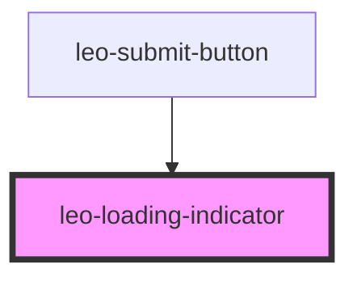

# leo-loading-indicator

<!-- Auto Generated Below -->

## Properties

| Property | Attribute | Description | Type                                  | Default   |
| -------- | --------- | ----------- | ------------------------------------- | --------- |
| `color`  | `color`   |             | `"primary" \| "secondary" \| "white"` | `'white'` |

## Dependencies

### Used by

 - [leo-submit-button](../leo-submit-button)

### Graph

----------------------------------------------

*Built with [StencilJS](https://stenciljs.com/)*
