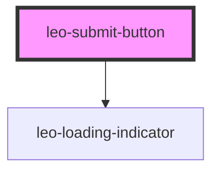

# leo-submit-button

<!-- Auto Generated Below -->

## Properties

| Property            | Attribute | Description      | Type                       | Default     |
| ------------------- | --------- | ---------------- | -------------------------- | ----------- |
| `color`             | `color`   | The button color | `"primary" \| "secondary"` | `'primary'` |
| `text` _(required)_ | `text`    | The button text  | `string`                   | `undefined` |

## Events

| Event      | Description                                    | Type                |
| ---------- | ---------------------------------------------- | ------------------- |
| `leoClick` | Emitted when the button goes into loading mode | `CustomEvent<void>` |

## Methods

### `showLoader(show?: boolean) => Promise<void>`

Show or hide the loader based on the parameter passed

#### Returns

Type: `Promise<void>`

## Dependencies

### Depends on

- [leo-loading-indicator](../leo-loading-indicator)

### Graph

----------------------------------------------

*Built with [StencilJS](https://stenciljs.com/)*
